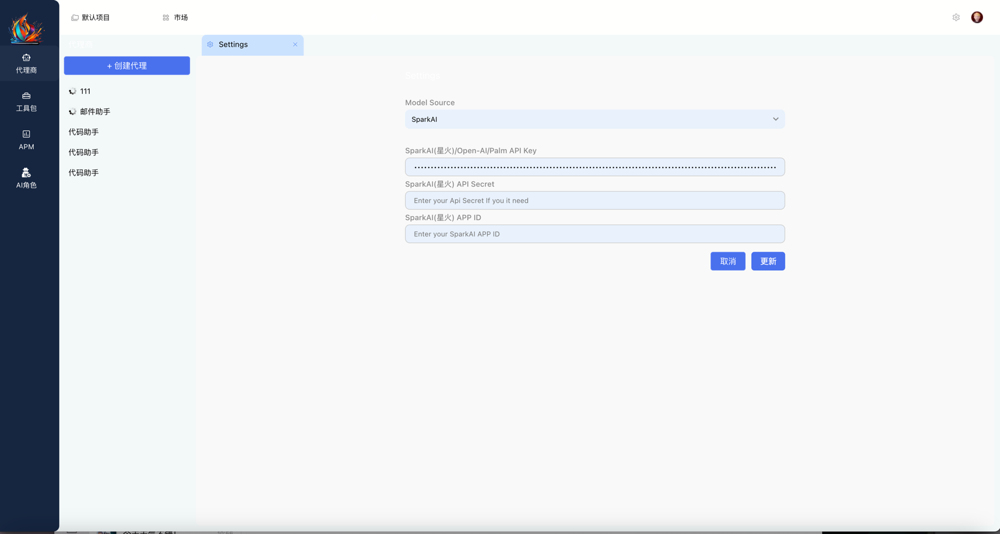
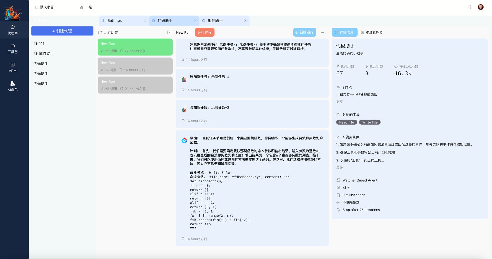

  

<i>专注中文领域的AI智能体应用开发框架</i>

<b>欢迎关注AutoSpark </b>

## 📽 介绍

AutoSpark是一款专注中文领域大模型AI智能体(Agent)应用框架, 当前版本基于[SuperAGI](https://github.com/TransformerOptimus/SuperAGI) v0.0.7 Fork版本开发，致谢SuperAGI项目!!!

##   ***注意***
* ⚠️ ⚠️ ⚠️ 开发中!⚠️ ⚠️ ⚠️ 
当前版本仍处于开发测试中，请勿用于生产环境，部分特性还未合并到开源分支

## 💡 特性

以下特性来源于原[SuperAGI](https://github.com/TransformerOptimus/SuperAGI):

- 生成和部署自主人工智能代理
- 使用工具扩展智能代理能力集
- 无缝并发运行任务、智能代理
- 图形化交互页面
- 多向量数据库支持
- 多模态智能代理
- 智能代理轨迹微调
- 智能代理监控
- Looping Detection Heuristics 
- Concurrent Agents
- 资源管理

已新增主要特性:

- 接入[讯飞星火 PythonSDK](https://github.com/iflytek/spark-ai-python)
- 新增基于星火大模型的默认交互工作流
- 优化并新增内置中文Prompts
- 优化部分工具Tool以支持中文场景
- 去除部分内置国外插件

未来计划支持特性:

- 支持GUI定制AI角色和工作流
- 优化循环检测方式，更智能优雅的结束任务，避免死循环
- 支持在线修改角色Prompt
- 新的产品化UI
- 支持工具插件动态注册

## 🛠 工具套件

## 💻 示例Demo

[//]: # (**CLI View**)

**GUI**

## 🛣 Roadmap
[关注最新RoadMap讨论 🔗](https://github.com/iflytek/AutoSpark/discussions/1)

<a id="architecture">

## 🌐 架构

当前基础架构基于 SuperAGI，LLM新增 Spark，未来架构可能会做些许调整。

以下内容来源于 [SuperAGI](https://superagi.com)

</a>

SuperAGI Architecture

Agent Architecture

Agent Workflow Architecture

Tools Architecture

ER Diagram

## ⚙️ 使用

1. 下载仓库: `git clone https://github.com/iflytek/autospark.git` 或者使用github页面上的下载Zip功能下载
2. 进入到 `cd autospark` 并拷贝`config_template.yaml` 为 `config.yaml` (一定要注意后缀是 `.yaml`, *而不是* `.yml`).
3. 如需使用OpenAI LLM，清参考 SuperAGI配置方式配置,星火LLM配置可以在启动后做配置

4. 确保你的环境使用了docker以及 `docker-compose` ，可以从这里安装: [here](https://docs.docker.com/get-docker/). 
5. 确保docker环境ok之后:  再在autospark目录中执行 `docker-compose up --build` 然后打开浏览器访问 `http://localhost:3000` 访问AutoSpark
   - 如果想更改默认端口，请自行修改 `docker-compose.yml` 文件
6. 完成后,点击右上角齿轮配置 SparkAI ，你需要提前准备 APPID, API_KEY, API_SECRET, 可以从[讯飞开放平台](https://xinghuo.xfyun.cn/)申请。

## Faq && 注意事项

* ⚠️ ⚠️ ⚠️ 开发中!⚠️ ⚠️ ⚠️ 
   
   答: 当前版本仍在抓紧开发中，我们基于SuperAGI，但是未来发展重心会明显区别于SuperAGI

* 为什么基于SuperAGI，而不是重新开发一套

   答: 没必要且时间不允许，且这才是开源的魅力，站在巨人的肩膀，重复造轮子不可取，我们也欢迎任何人基于我们的项目继续开发。

* 为什么不把LLM实现集成到SuperAGI？
    
  答: 
  * AutoSpark的发展定位会有别于SuperAGI，主要区别在于我们会专注于中文领域大模型，以及像Prompts调优之类，都是基于中文
  * 我们会积极的向上游提供Pr，比如在一些通用的特性上，如TOOL的动态注册方案，时间ok的时候，我们会及时的PR给SuerAGI项目

* 实际在星火上的效果不太好

  答:
  * 我们正在紧锣密鼓的调优框架，大模型本身效果也在逐步提升，可以关注临近的[星火大模型发布会](https://xinghuo.xfyun.cn/)请关注:

  

## 关联项目
[Spark AI Python SDK](https://github.com/iflytek/spark-ai-python)

## 鸣谢
[SuerAGI](https://github.com/TransformerOptimus/SuperAGI#)
[AutoGPT](https://github.com/Significant-Gravitas/Auto-GPT)

## 👩‍💻 贡献者

 

