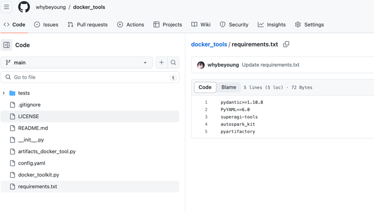

# AutoSpark Toolkit 开发指南

## 准备python环境

## 安装 autospark_kit

```bash
pip install autospark_kit

```

## clone示例项目

```bash
git clone https://github.com/whybeyoung/docker_tools.git

```

## 参考示例项目进行开发

1. github 创建一个 github项目，名称为你定义的toolkit名称
2. 你的项目结构组织应该如下:
Your repository structure should look something like this:

```bash
Your-Repository-Name
├── __init__.py
├── xxx_tool.py
├── xxxx_tool.py
├── toolname_toolkit.py
└── requirements.txt
```
如: [docker_tools](https://github.com/whybeyoung/docker_tools)



## 测试

todo

## 发布，安装到 autospark

1. 页面add
2. 重启autospark实例自动注册
